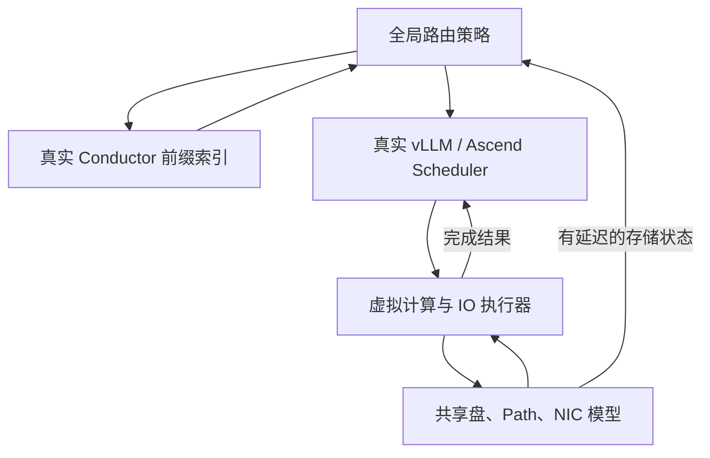

# 全局调度仿真方案

**User:** Anonymous  
**Created:** 9/22/2026 19:31:56  
**Updated:** 9/22/2026 21:41:45  
**Exported:** 9/22/2026 21:47:49  
**Link:** [https://chatgpt.com/c/6ab26723-6e8c-83ec-8caf-ad7e1875cafa](https://chatgpt.com/c/6ab26723-6e8c-83ec-8caf-ad7e1875cafa)  

## Prompt:
2026/9/22 19:31:46

如果我想基于搭建一个仿真环境，但是调度器和推理引擎层都用真实的代码，调度器就用真实的mooncake Conductor的代码，推理引擎层就用真实的vllm代码（包括vllm-ascend适配）。仿真环境就运行在CPU上，对于需要NPU实际跑的，或者需要接存储的，全部mock成仿真的代码。这样对于调度策略的修改（例如考虑存储状态），完全是基于真实代码进行的，相比于直接搭一个仿真框架，更不易失真。你考虑一下这个方案的可行性，以及如果能干的话应该怎么干？给一个详细的分析和设计方案。我希望能根据你给的这个代码能直接搭。

## Response:
2026/9/22 19:31:58

我会先核实 Mooncake Conductor、vLLM 和 vLLM-Ascend 当前公开代码的边界，再确定哪些调度逻辑能直接复用、哪些执行接口需要仿真，并据此整理可运行的骨架和搭建步骤。

这次我会把结果做成中文设计文档和代码包，并使用文件保存技能保存交付物。关键是找到真实调度器与硬件执行之间的切分点，确保 mock 不会把排队、KV 分配和完成事件这些影响策略的行为一起替换掉。

发现了一个会影响方案的关键点：Mooncake 当前主线里的 Conductor 已经有真实的前缀索引和事件订阅代码，但不能直接等同于论文中完整的全局调度器；社区还在分阶段合入相关实现。因此方案需要明确区分“复用官方 Conductor 已公开的能力”和“新增存储感知路由策略”，否则会把自写策略误当成官方基线。

vLLM 这边已经确认有合适的切分点：保留真实的请求队列、batch/chunk 选择、KV block 分配和抢占逻辑，由仿真器在虚拟时间到达后回送执行结果。vLLM-Ascend 也有可单独复用的 `AscendScheduler`；我正在验证它能否脱离 NPU worker 在 CPU 上运行。性能数字仍需用 NPU 实测数据校准，真实调度代码本身不能保证时延模型准确。

已经把 Mooncake 原始 C++ 前缀索引编译起来，并验证了完整命中和中途断开的前缀查询。代码包会保留两条 KV 加载路径：整段异步加载完成后进入 batch，以及按层加载、整个 batch 在每层等待所需 KV 到齐；这样能分别研究请求级等待和层内 IO stall。

现在已经在 CPU 上跑通了真实 vLLM Scheduler 和真实 AscendScheduler，两种 KV 加载路径都能完成请求；也单独跑了 Ascend 的 prefill-first 分支。15 项验证已通过，涵盖共享带宽重新分配、按层等待、异步完成回报、chunk 不提前产出 token，以及 KV 容量不足时真实抢占和重计算。接下来我会验证全新环境的一键安装，并补齐设计文档和研究扩展边界。

全新隔离环境的安装验证也已完成，16 项测试全部通过。交付包现在包含可直接修改的上游源码、固定版本与文件哈希、运行脚本、Mooncake trace 转换器和中文设计文档。文档会明确指出尚未实现的部分：完整 PD 交接、动态 KV 写回/淘汰、EngineCore 集成和 NPU 时延校准。

设计文档和约 3.9 MB 的代码包已经整理完成，正在保存。代码包中附有验证记录；解压后运行安装脚本，再执行 `python -m lab.run`，即可跑起这个经过验证的起步环境。

> **查找工作区中的 AGENTS 文件**
>
>
> **查找了工作区中的 AGENTS 文件**
>
> 
>
> **检查 Python 环境与依赖可用性**
>
>
> **检查了Python环境与依赖可用性**
>
> 
>
> **已搜索 4 个网站**
>
> 
>
> **Checking package availability**
>
> **Checking package availability**
>
> **检查了包裹可用性**
>
> 
>
> **检索并汇总 Mooncake 与 vLLM 最新信息**
>
> 
>
> **获取项目分支、标签及调度器资料**
>
>
> **获取了项目分支、标签及调度器资料**
>
> 
>
> **介绍 Mooncake Conductor 使用方法**
>
> 
>
> **检查调度器代码与测试**
>
>
> **检查调度器代码与测试**
>
> 
>
> **获取并分析Mooncake代码及Issue评论**
>
> 
>
> **并发下载 Mooncake 与 vLLM 研究资料**
>
>
> **并发下载 Mooncake 与 vLLM 研究资料**
>
> 
>
> **查看 vLLM 与 Conductor 研究文件**
>
>
> **Planning dynamic module loading**
>
> **Planning dynamic module loading**
>
> **规划了动态模块加载方案**
>
> 
>
> **查阅并下载 vLLM、Conductor及Ascend研究资料与代码**
>
> 
>
> **安装指定版本的 vLLM**
>
>
> **安装指定版本 vLLM及日志JSONCPP依赖并读取设计文档**
>
> 
>
> **分析 Conductor 与 Mooncake 工具及前缀索引测试实现**
>
> 
>
> **应用代码补丁**
>
>
> **应用补丁并验证 vLLM 调度器及前缀索引依赖**
>
> 
>
> **Implementing event storage**
>
> **Implementing event storage**
>
> **Implementing Conductor event hooks**
>
> **Implementing Conductor event hooks**
>
> **实现事件存储与 Conductor 事件钩子**
>
> 
>
> **检查哈希实现与平台代码**
>
>
> **Building unified worker starter**
>
> **Building unified worker starter**
>
> **Implementing connector token state**
>
> **Implementing connector token state**
>
> **构建统一工作器启动器并实现连接器令牌状态管理**
>
> 
>
> **导入并检查 vLLM 调度器**
>
>
> **Computing LUT design fields**
>
> **Computing LUT design fields**
>
> **计算LUT设计字段**
>
> 
>
> **检查 vLLM 配置与请求调度代码**
>
>
> **Building adapter source**
>
> **Building adapter source**
>
> **Configuring SimConnector factory**
>
> **Configuring SimConnector factory**
>
> **构建适配器源码并配置SimConnector工厂**
>
> 
>
> **应用补丁修改文件**
>
>
> **检查并修改 vLLM 调度代码，构建验证 Conductor**
>
> 
>
> **安装指定 Python 依赖包**
>
>
> **Fixing zero-match async flag**
>
> **Fixing zero-match async flag**
>
> **Adding worker queue metrics**
>
> **Adding worker queue metrics**
>
> **修复异步零匹配标记并添加工作队列指标**
>
> 
>
> **应用代码补丁**
>
>
> **Preparing Ascend branch tests**
>
> **Preparing Ascend branch tests**
>
> **Preparing design package**
>
> **Preparing design package**
>
> **准备Ascend分支测试与设计包**
>
> 
>
> **配置昇腾预填充优先引擎**
>
>
> **Fetching license text**
>
> **Fetching license text**
>
> **Creating clean verification environment**
>
> **Creating clean verification environment**
>
> **获取许可证文本并创建干净验证环境**
>
> 
>
> **列出已加载 Python 包版本**
>
>
> **Adding aiohttp to requirements**
>
> **Adding aiohttp to requirements**
>
> **添加了 aiohttp 依赖**
>
> 
>
> **统计 vLLM 包文件大小**
>
>
> **Testing exact hash bytes**
>
> **Testing exact hash bytes**
>
> **测试精确哈希字节蕴含**
>
> 
>
> **运行设置脚本并记录日志**
>
>
> **安装依赖并修改代码，运行vLLM与昇腾异步分层加载实验**
>
> 
>
> **Adding isolated TTFT metrics**
>
> **Adding isolated TTFT metrics**
>
> **Adding normalized TTFT metric**
>
> **Adding normalized TTFT metric**
>
> **添加独立及归一化TTFT指标**
>
> 
>
> **获取并审查 vLLM Ascend 与 Mooncake 许可证内容**
>
> 
>
> **检查安装日志和许可证文件**
>
>
> **检查了安装日志和许可证文件**
>
> 
>
> **已搜索 3 个网站**
>
> 
>
> **Adding warmup prefix seeding**
>
> **Adding warmup prefix seeding**
>
> **Preparing pool seed output**
>
> **Preparing pool seed output**
>
> **添加预热前缀并准备池种子输出**
>
> 
>
> **自动审核已停止**
>
> 
>
> **应用补丁更改**
>
>
> **Retrying setup after timeout**
>
> **Retrying setup after timeout**
>
> **重试设置操作**
>
> 
>
> **应用代码补丁更改**
>
>
> **应用补丁并离线安装依赖，生成锁定文件并测试-vesm**
>
> 
>
> **查看清理设置日志末尾**
>
>
> **Preparing document content**
>
> **Preparing document content**
>
> **准备文档内容**
>
> 
>
> **应用代码补丁修改**
>
>
> **Generating dependency lock**
>
> **Generating dependency lock**
>
> **Generating CPU lockfile**
>
> **Generating CPU lockfile**
>
> **生成依赖和 CPU 锁定文件**
>
> 
>
> **验证并运行多引擎实验**
>
>
> **Checking prefill-first tests**
>
> **Checking prefill-first tests**
>
> **Checking upload helper**
>
> **Checking upload helper**
>
> **检查了预填充测试和上传辅助工具**
>
> 
>
> **验证并运行多引擎实验**
>
> 
>
> **应用补丁修改代码**
>
>
> **Verifying current record**
>
> **Verifying current record**
>
> **核实了当前记录**
>
> 
>
> **打包月饼 CPU 实验项目**
>
> 
>
> **Checking WSL2 memory guidance**
>
> **Checking WSL2 memory guidance**
>
> **检查了WSL2内存配置建议**
>
> 
>
> **上传 Mooncake 模拟设计文件**
>
> 
>
> 思考了 115m 28s

**可以实现，而且很适合你研究“共享存储状态如何影响全局调度和引擎调度”。我已经做出一套在 CPU 上运行验证过的起步工程，附上完整设计和源码。**

- [Mooncake_vLLM_CPU_Simulation_Design.zh-CN.md](sandbox:/workspace/scratch/74bf90e1d522/Mooncake_vLLM_CPU_Simulation_Design.zh-CN.md)：详细设计、接口、存储模型、校准方法和后续实施步骤。
- [mooncake-cpu-lab.zip](sandbox:/workspace/scratch/74bf90e1d522/mooncake-cpu-lab.zip)：约 3.9 MB，包含固定版本的上游源码、仿真代码、安装脚本、样例和测试。

先说明一个会影响整体方案的事实：**当前公开的 Mooncake Conductor，不能直接当成论文中完整的全局调度器。** 官方文档将它定位为供 cache-aware router 使用的 KV 前缀索引：Conductor 返回命中信息，router 再选择实例。因此，这份工程复用了真实 Conductor 索引，全局路由策略明确作为新增模块。([kvcache-ai.github.io](https://kvcache-ai.github.io/Mooncake/design/conductor/conductor-architecture-design.html?utm_source=chatgpt.com))

下面把关键设计和实际交付边界展开。

**你的判断成立，但需要区分两种“保真”。**

| 保真维度 | 复用真实代码能解决什么 | 还需要做什么 |
|---|---|---|
| 调度行为 | 实际队列规则、batch/chunk 选择、KV 分配、抢占、重计算 | 对齐你最终使用的上游版本 |
| 执行性能 | 保留调度决策产生的工作量和依赖关系 | 校准计算时延、IO 竞争、通信重叠 |
| 系统集成 | 策略修改可以落在真实代码上 | 验证 EngineCore、PD 交接和 NPU 插件调用链 |

所以，这个方向比重新写一套近似 scheduler 更容易保持**调度语义一致**，但性能可信度仍取决于执行模型。

**合理的切分点，是保留真实调度和资源管理，让仿真器负责完成事件。**



核心闭环是：

```python
scheduler.add_request(request)

scheduled = scheduler.schedule()   # 真实代码决定本轮算谁、算多少

# 仿真器计算这一轮何时完成，并在对应虚拟时刻回调。
virtual_executor.submit(scheduled, on_complete)

# 到达完成时刻后，再推进真实请求状态。
scheduler.update_from_output(scheduled, model_runner_output)
```

vLLM 的真实 Scheduler 已经包含 `schedule()`、`update_from_output()` 和远端 KV 等待状态处理，适合从这里切入。([docs.vllm.ai](https://docs.vllm.ai/en/v0.11.0/api/vllm/v1/core/sched/scheduler.html?utm_source=chatgpt.com))

这样可以保留会影响你实验结果的关键行为：token budget、continuous batching、chunk 推进、KV 容量不足、抢占和重计算。直接把 NPU 调用改成空函数，则很容易让尚未完成的计算或 IO 被误认为已经完成。

**这份代码现在实际运行了什么：**

| 部分 | 当前实现 |
|---|---|
| Mooncake | 编译执行原始 C++ `PrefixCacheTable` 和 hash 代码 |
| vLLM | 执行原始 V1 `Scheduler`、请求状态和缓存管理代码 |
| vLLM-Ascend | 执行原始 `AscendScheduler`，另测了 prefill-first 分支 |
| 全局策略 | 提供轮询、计算负载感知、存储感知三个示例 |
| 本地策略 | 提供在真实 scheduler 前重排 waiting 队列的示例 |
| 计算执行 | 根据真实 batch 生成虚拟计算事件 |
| 存储执行 | 多盘、Path FIFO、worker NIC、多资源共享带宽 |
| 状态反馈 | 支持采样周期和传递延迟 |
| 输出 | TTFT、makespan、SLO、goodput、compute/stall/idle、事件轨迹 |

版本固定为 **vLLM 0.11.0 + vLLM-Ascend 0.11.0**，Mooncake 固定到本次核对的提交。这里选择的是经过验证的起步版本，**并非声称它们是最新版本**。包中记录了提交号和源码哈希，之后应迁移到你的实际部署版本并重新验证。

**针对你的研究，KV 加载必须保留两种不同语义。**

第一种是**整段异步加载**：

请求发现远端命中后，真实 scheduler 分配 KV slots，并进入 `WAITING_FOR_REMOTE_KVS`。只有仿真 IO 完成、回送 `finished_recving` 后，请求才能继续计算。

第二种是**按层加载与计算重叠**：

真实 scheduler 先形成 batch；执行第 $i$ 层前，等待该 batch 中所有相关请求的第 $i$ 层 KV 到齐，再开始这一层计算。工程支持有限的按层预取窗口。

vLLM 的 connector 接口本身区分了 scheduler 侧命中查询、分配后状态更新，以及 worker 侧加载、逐层等待和完成回报，可以承载这种切分。([docs.vllm.ai](https://docs.vllm.ai/en/v0.11.0/api/vllm/distributed/kv_transfer/kv_connector/v1/base.html?utm_source=chatgpt.com))

两条路径已经分别实现，避免“batch 前等了一次完整 IO，batch 内又重复计算同一笔 IO”的错误。

**共享存储模型必须是全局共用的。**

你关心的是：NPU A 的调度顺序改变后，会不会影响 NPU B 获得的带宽。因此代码不会给每个 worker 创建互不相关的存储模型。

每条活跃 IO 同时受以下约束：

- 所在盘的总带宽；
- 所选 Path 的队列和带宽上限；
- 对应 worker 的 NIC 带宽。

每次有新 IO 加入或旧 IO 完成，都会重新分配带宽、更新剩余字节和完成事件。默认配置包含**每盘 256 Path、盘总带宽 40 GB/s**；你已有的 SS/LS/SL/LL 分组配额，需要进一步作为组级资源约束加入。设计文档给出了具体接入方式。

**策略修改可以落到真实源码，但不同修改的范围不同。**

| 你想研究的问题 | 修改位置 |
|---|---|
| 请求发往哪个 worker | `lab/run.py` 的全局路由策略 |
| 如何查询真实前缀命中 | Conductor 原始索引代码与包装接口 |
| waiting 请求如何排序 | 当前示例在 `lab/engine.py` |
| running 顺序、chunk 大小、token 预算、抢占对象 | 包内真实 vLLM scheduler 源码 |
| Ascend prefill-first 行为 | 包内真实 `AscendScheduler` |
| Path 选择、IO 排序、共享带宽策略 | `lab/storage.py` |

需要特别注意：**只重排 waiting 队列，不等于实现了完整的存储感知 batch 调度。** 如果要改变 running 请求竞争、chunk 分配或抢占对象，就应修改真实 `schedule()` 中对应的位置。文档逐项列出了这些修改点和必须保留的约束。

**搭建可以直接从下面开始。**

建议使用 Linux x86_64；Windows 使用 WSL2 Ubuntu。

```bash
unzip mooncake-cpu-lab.zip
cd mooncake-cpu-lab

# 系统依赖，已有则跳过。
sudo apt-get update
sudo apt-get install -y g++ libssl-dev python3-pip unzip
python3 -m pip install --user uv

bash scripts/setup.sh
```

运行真实 vLLM 调度器：

```bash
.venv/bin/python -m lab.run --out results/vllm
```

运行真实 AscendScheduler：

```bash
.venv/bin/python -m lab.run \
  --engine ascend \
  --config configs/ascend-prefill-first.json \
  --out results/ascend
```

切换整段异步加载，或运行策略对比：

```bash
.venv/bin/python -m lab.run --load-mode async_full

.venv/bin/python scripts/compare.py
```

**我已经在全新隔离 Python 环境验证安装，16 项测试全部通过。** 覆盖真实抢占与重计算、KV block 回收、共享带宽动态变化、按层 barrier、异步 KV 完成、chunk 不提前产出 token，以及确定性回放。

同时，交付还不是完整生产系统的 CPU 替身：**尚未实现完整 PD 交接、动态 KV 写回/淘汰、完整 EngineCore 集成，也没有完成 NPU 性能校准。** 默认计算系数是演示值，结果明确标记 `timing_calibrated=false`，不能据此宣称真实 NPU 上的性能提升。

对你目前的课题，最合适的下一步是：先用这套工程接入你的 **ASU Path 分组规则和真实 trace**，验证全局与本地策略的消融；随后用 NPU/CMS 数据校准执行模型。完整设计文档已经给出这两步，以及后续 PD、EngineCore 和实机迁移的实施方案。

---

**Sources:**

- [Conductor Architecture](https://kvcache-ai.github.io/Mooncake/design/conductor/conductor-architecture-design.html?utm_source=chatgpt.com)
- [scheduler](https://docs.vllm.ai/en/v0.11.0/api/vllm/v1/core/sched/scheduler.html?utm_source=chatgpt.com)


---
Powered by [ChatGPT Exporter](https://www.chatgptexporter.com)