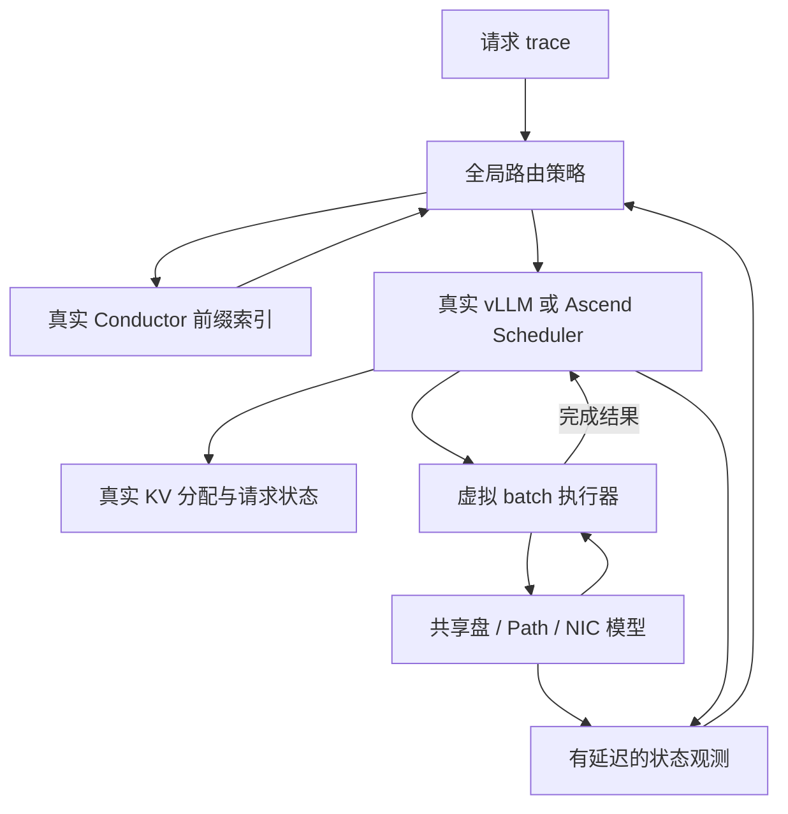
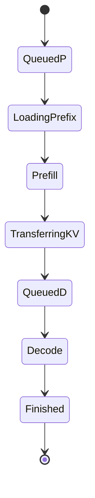

# 基于真实 Mooncake / vLLM / vLLM-Ascend 控制代码的 CPU 仿真方案

版本日期：2026-09-23。代码包：`mooncake-cpu-lab`。

## 1. 结论与必要纠正

**方案可以实施，而且很适合研究“共享存储状态如何影响全局路由和推理引擎调度”。** 最合适的形态是让真实控制代码生成调度决策，由离散事件仿真器决定计算与 IO 何时完成，再通过真实结果接口推进请求状态。

这个方案提高的是控制行为的一致性：真实队列规则、batch 预算、chunk 推进、KV block 分配、抢占和释放都会影响结果。它不会自动解决性能建模失真：计算时延、通信重叠、盘 / Path / NIC 竞争和观测延迟仍需要建模、校准。

有一个必须纠正的前提：**当前公开 Conductor 与论文中的完整 Conductor 调度器不能直接画等号。** 官方现行架构文档把 Conductor 定位为 cache-aware router 使用的 KV-cache indexer；router 查询索引后再选择实例。2026-09-22 检查的主线提交已经包含 C++ 前缀索引、hash、ZMQ 解码和订阅组件，但不能从这些文件推导出“完整论文路由、预测式拒绝、PD 编排策略均已有可直接调用的官方实现”。

同时，在线文档还保留了旧 Go 目录和启动命令，而该提交主线是 C++ 分阶段合入结构。因此本交付选择**锁定实际存在的 C++ 索引库**，不照搬过时的 `conductor-ctrl/main.go` 启动方式，也不把自写 router 命名为官方 Conductor scheduler。

你可以在现在的代码上直接研究存储感知策略；如果研究要求“全局基线必须逐行等同于 Moonshot 论文内部生产路由器”，还必须先获得对应代码与确切提交，现有公开索引库不足以满足这条更强要求。

## 2. 已交付工程的真实边界

| 层 / 功能 | 当前采用什么 | 是否真实执行上游代码 |
|---|---|---|
| Conductor 前缀索引与 hash | 原始 `PrefixCacheTable`、`HashStrategy`，C ABI 包装 | 是，实际编译 C++ |
| 全局请求路由 | 本工程的 RR / least-tokens / storage-aware 示例 | 新增研究策略，不是官方论文基线 |
| vLLM 请求调度 | V1 `Scheduler.schedule()` / `update_from_output()` | 是 |
| Ascend 本地调度 | v0.20.2rc1 原始 `BalanceScheduler`，默认均衡关闭 | 是 |
| 请求状态与输出长度 | 原始 `Request`、`SamplingParams`、停止检查 | 是；生成 token 内容为占位值 |
| KV 容量、block 分配、抢占释放 | 原始 `KVCacheManager`、`BlockPool` 等 | 是；只分配逻辑元数据 |
| KVConnector | 遵守原始基类接口的 `SimConnector` | 新增仿真 connector |
| batch / layer 执行 | `Batch` 根据真实调度结果建立虚拟执行计划 | 仿真 |
| 共享盘、Path、NIC | 全局共享的动态流体带宽模型 | 仿真 |
| 遥测延迟 | 有时间戳的 snapshot + 延迟交付 | 仿真 |
| EngineCore / 多进程 RPC / OpenAI HTTP 服务 | 当前不启动 | 后续集成阶段 |
| torch_npu / CANN / HCCL / NPUWorker | 当前不启动 | 后续实机验证 |
| 完整 PD 分离 | 当前同一 worker 完成 prefill 与 decode | 已设计，尚未实现 |
| 共享池写回、迁移、淘汰 | 当前固定初始只读池 | 已设计扩展边界，尚未实现 |
| 本地 HBM automatic prefix caching | 当前显式关闭，保留真实 block 管理 | 后续加入事件同步 |

这里“包括 vLLM-Ascend 适配”落实到**真实 Ascend 调度代码可在 CPU 上运行**，不表示整套 NPU 插件已经被透明 CPU 化。无需加载模型权重或申请真实 HBM。

## 3. 固定版本与源码管理

| 项目 | 本交付版本 | 固定提交 |
|---|---|---|
| Mooncake | 2026-09-22 主线快照 | `fd72779c2ee8ec28379bc6487f2113e3efe418d8` |
| vLLM | `v0.20.2` | `bc150f50299199599673614f80d12a196f377655` |
| vLLM-Ascend | `v0.20.2rc1` | `367b8e62da799870a7476ce34f5f7658589a8aad` |
| PyTorch | `2.11.0+cpu` | 安装 CPU wheel |
| Python / C++ | Python 3.12 / C++20 | 验证环境 Python 3.12.14、g++ 13 |

按本次要求固定为 vLLM v0.20.2 与 vLLM-Ascend v0.20.2rc1，Mooncake 提交保持不变。已同步适配 Scheduler 构造参数、Request、FullAttentionSpec、KVConnector、hash 导入位置和请求等待队列。

CPU 实验环境使用 vLLM v0.20.2 的 CPU 依赖版本 `torch==2.11.0+cpu`、`transformers==5.5.3`。Ascend rc1 的真实 NPU requirements 则指定 torch/torch-npu 2.10.0；两者属于不同执行环境。本工程仅载入 Ascend 的设备无关调度代码，**不要在这个 CPU 虚拟环境再安装完整 vllm-ascend / torch-npu 包**。迁移到 NPU 时必须按 Ascend 的安装要求另建环境。

包内 vLLM Python 源码来自固定 wheel；核心 scheduler 与对应 tag 原始文件逐字节比对一致。Ascend scheduler 和 Mooncake 索引源码来自对应提交。`UPSTREAM.lock.json` 保存所有初始文件的 SHA-256；对源码做修改后，应保留原始 lock，并保存实验 patch，而不是悄悄改写基线哈希。

## 4. 总体架构



整个集群共享一个事件时钟与一个存储资源模型。每个 worker 有自己的真实 scheduler、请求集合和 KV block pool。这样一个 worker 发起的新 IO 会改变其他 worker 的可用带宽与预计完成时刻。

主干接口是：

```python
scheduler.add_request(real_request)
scheduled = scheduler.schedule()
# scheduled 由原始代码决定：请求集合、token 数、KV block 等。
virtual_executor.submit(scheduled, completion_callback)
# 仅当相应虚拟计算 / IO 完成后：
scheduler.update_from_output(scheduled, real_model_runner_output)
```

起步工程用一个 Python 进程托管多个 scheduler，避免真实网络和进程线程的不确定性。这个事件驱动循环是新增的；保留的是实际 scheduler 和资源状态机，并不是完整复用 EngineCore 主循环。

## 5. 为什么切在 scheduler 与执行之间

如果仅把 `torch.npu` 相关调用替换为空函数，真实 worker 启动还会触发设备查询、显存 profiling、算子注册、torch_npu 导入、图捕获、通信组初始化和设备流同步。大量空返回又可能让“还没完成的数据”被当成已就绪，破坏你的研究问题。

更稳妥的切分是：保留决定“谁能进入下一轮、分配多少资源”的代码，模拟“这一轮什么时候完成”。

| 必须保留 | 原因 |
|---|---|
| waiting / running 队列和真实优先规则 | 防止把官方调度顺序重写成另一套模型 |
| token budget、max_num_seqs、chunk 规则 | 这些规则决定 batch 组成和长短请求干扰 |
| KV block 分配、释放、容量压力 | 内存不足会改变调度、抢占、重计算 |
| 外部 KV 命中和等待状态转换 | 命中不意味着已经加载到设备 |
| 请求停止、输出 token 数、回收 | 避免提前结束、重复释放或尾部泄漏 |

| 可以模拟 | 模拟结果必须表达什么 |
|---|---|
| 模型 forward | 完成时刻、该轮产生几个 token、错误情况 |
| 存储 / RDMA 传输 | 已提交、仍在等待、完成、失败；不能永远成功且零时延 |
| HBM 张量 | 逻辑 block 生命周期和容量；无需真实 tensor 数据 |
| 遥测通道 | 采样时刻、送达时刻、丢失 / 过期状态 |

本工程构造轻量的 model/parallel 配置输入，关闭多模态、结构化输出、speculative decoding、TP/PP。真实 `CacheConfig`、`SchedulerConfig` 和缓存管理代码仍被使用。`NoStructuredOutput` 是明确禁用的功能边界，不是替换请求调度。

## 6. KV 加载两种语义：必须分别建模

### 6.1 整段异步加载：`async_full`

connector 返回外部命中 token 数与异步加载标记。真实 scheduler 为它分配 KV slots，将请求转入 `WAITING_FOR_REMOTE_KVS`。随后存储模型执行传输。

```text
查询命中 → 真实 KV 分配 → 等待远端 KV → 虚拟 IO 完成
→ KVConnectorOutput.finished_recving
→ 真实 scheduler 恢复请求 → 计算未命中部分
```

不能在提交 IO 时把请求直接置为 runnable。代码只在 IO 完成后回送 `KVConnectorOutput`；如果 worker 正在执行一个 batch，完成集合会等到合法的调度边界再消费。无计算的轮次也会消费 connector 完成结果，避免“没有 runnable 请求所以永远收不到 IO 完成”的死锁。

### 6.2 按层加载：`layerwise`

connector 报告同步可加载命中，真实 scheduler 选出 batch。仿真执行器接管对应 worker 侧的等待语义：每层必须等到**这个 batch 中需要外部 KV 的所有请求**的该层数据就绪，才启动这一层计算。

设 batch 为 B，层号为 l，外部 KV 就绪时刻为 a(r,l)，上一层计算结束为 f(l-1)：

\[
s(l)=\max\left(f(l-1),\max_{r\in B}a(r,l)\right),\qquad
f(l)=s(l)+C(B,l)
\]

这保留了 batch 内一个慢 IO 拖住整层计算的影响。它不是“batch 里的每个请求独立完成整条层流水线”。`prefetch_layers` 控制有限的按层预取窗口；某层计算完成后再推进窗口。

两种模式不能混用：整段异步加载已经在 batch 之前等待过，就不能在 batch 内重复收取相同远端 KV 的传输时间。工程通过独立路径避免重复计费。

**当前层计划本身由仿真器生成，未执行 Ascend 模型 runner 的真实层循环。** 因而“真实层加载流、算子流、图捕获和通信重叠是否完全等同”仍是后续校准与回放验证问题。

## 7. 共享存储模型如何反映跨 NPU 干扰

起步模型支持多个盘、每盘多个 Path、每条 Path FIFO，以及每个 worker 的共享 NIC 容量。默认盘数 2、每盘 256 Path、每盘 40 GB/s；NIC 示例值为 1.2 GB/s，用来制造可见的 IO 竞争，不对应具体真实网卡产品。

KV block 用 Conductor 计算的稳定前缀 hash 映射到一个带虚拟节点的一致性哈希环，从而确定盘。Path 当前由 `(worker_id, block_hash)` 的稳定 hash 选择。对同一盘 / Path 的多个块合并为一次队列作业。

每个活跃 flow 同时占用盘、Path、worker NIC 三类资源，速率必须满足：

\[
\sum_{f\in\mathrm{disk}(d)}r_f\le B_d,\quad
\sum_{f\in\mathrm{NIC}(w)}r_f\le B_w,\quad
r_f\le B_{\mathrm{path}(f)}.
\]

用 progressive filling 计算多资源 max-min 公平份额。新 flow 到达或旧 flow 完成时，先按旧速率结算已传字节，再计算新速率，取消过时的完成事件并安排新的完成时刻。

因此不使用“请求一开始就固定 `size / 带宽` 的完成时间”，也不为每个 NPU 分别创建一个互不影响的存储模型。代码中的测试验证了第二个 flow 到来后，第一个 flow 的完成时刻会被推迟。

**你当前的 ASU Path 分组策略应当作为独立 policy 再加进去。** 本工程支持单 Path 上限，但没有把 SS/LS/SL/LL 的预算硬编码进去。盘总容量与分组预算要同时约束；缺失的 SL/LL 配额不能凭空补齐。建议新增 `classify(hit_tokens,miss_tokens)`、`choose_path(class,state)` 和组级 capacity 资源，使 SS 20 GB/s、LS 12 GB/s 等配额与总盘 40 GB/s 一起进入带宽求解。

当前传输延迟在入队前建模；没有 MTU、packet、PFC、ECN、重传和 RDMA QP 仿真。研究目标若是 request/batch/storage 调度，这通常是合理首层抽象；如果策略依赖网络拥塞机制，应进一步使用实测服务曲线或网络仿真器。

## 8. KV 字节量、计算时延与校准

普通 GQA/MHA 的未压缩 KV 数据，每 token 每层的字节量为：

\[
S_{\mathrm{token,layer}}=2\times N_{\mathrm{KVheads}}\times d_{\mathrm{head}}\times s_{\mathrm{dtype}}.
\]

全模型乘层数 L，block 再乘 block_size。代码由 `model` 配置计算，不把“一个 token = 固定若干 KB”写死。默认 layers=8、KV heads=8 是小型演示几何参数，不对应某个指定模型。

这组参数被理解为**当前 worker 需要传输的本地 KV shard**。TP 下需要按实际 KV-head 划分或复制设置，不能无条件除以 TP；MLA、KV 压缩、量化、混合 attention、sliding window 需要另外定义几何结构。

计算模型目前按真实 batch 的新 token 数 q 与已有上下文 c 构造：

\[
C(B)=\alpha+\frac{\beta\sum_r q_r+\gamma\sum_r q_r(c_r+(q_r+1)/2)}{\eta(B)}.
\]

其中 c 包含已复用的 KV：复用可以减少 prefill 新 token 数，但这些历史 KV 仍参与 attention。这点不能省略，否则会高估长前缀命中的收益。当前所有层均分整 batch 时延；真实 MoE/异构层并不一定均匀。

建议生产研究中把 `compute_time()` 替换为 profile 表：

| 必须记录的维度 | 说明 |
|---|---|
| model/version、dtype、TP/PP/EP、硬件型号 | 固定实验配置，禁止混表 |
| batch_size、每请求 q、每请求 context | 不只记录 total_tokens，长短混合可能不同 |
| prefill/decode/mixed、chunk_size | continuous batching 的关键维度 |
| layer/group、graph/eager、通信耗时 | Ascend 图模式与通信重叠会改变服务时间 |
| compute-only / transfer-only / overlapped | 重叠不能仅由两项之和推测 |
| median、P95、样本数 | 仿真抖动可用经验分布 |

先测单请求与固定 batch，再测混合长短 batch、IO/compute overlap。留出独立验证集，检查 TTFT、batch 序列、stall、重计算次数和策略收益排名；没有覆盖的参数区间应报出外推，而不是静默延用公式。

## 9. 状态接口：真实状态与策略观测分开

仿真器持有资源真值，但策略只能读取送达的观测快照。否则“存储感知”可能实际上用了未来完成时间或实时全知信息。

本工程已模拟存储采样周期、消息延迟和带 `sample_time` 的观测；cache 索引由于使用固定初始池，查询目前是同步确定的。

| 状态 | 来源 | 策略用途 |
|---|---|---|
| 每盘剩余排队字节、活跃 Path | 存储侧 | 估算后端压力 |
| worker NIC 已排队字节 | 数据路径侧 | 区分不同 worker 的传输拥塞 |
| prefix 命中与介质 | Conductor | 确定哪些 KV 可复用 |
| waiting/running、剩余 token、当前 batch tokens | 引擎侧 | 估算排队与计算负担 |
| 采样时刻 / 送达时刻 | 遥测层 | 衡量状态过期程度 |

后续建议补充 Path 级剩余服务时间、限流预算、排队 IO 大小分布、读写竞争、慢盘状态、数据副本可达性、状态版本和预期误差区间。队列深度本身不能代替剩余字节；同样的 10 个 IO 可能是 4 KB，也可能是 256 MB。

一次路由会立即增加本地的 pending dispatch 记账，减少遥测尚未更新时连续请求都选择同一 worker 的问题。当前 cost 是启发式近似，并不是完成时间 oracle；没有预测未来请求，也不读取未来输出长度来安排优先级。trace 中 output_tokens 仅控制虚拟模型什么时候停止，调度策略不使用它预测未来。

## 10. 调度策略修改点与上游接口

### 10.1 全局层：请求发到哪个 worker

本工程 `Simulation.arrive()` 使用一个独立的 router policy。Conductor 查询供给前缀命中，存储 snapshot 提供排队量，引擎 snapshot 提供计算负担。

目前提供 RR、least-tokens、storage-aware 三个对照。其中 storage-aware 近似评价：

\[
\widehat{T}_w=\widehat{Q}_{w,compute}+\max(\widehat{Q}_{disk}+\widehat{T}_{disk},\widehat{Q}_{NIC,w}+\widehat{T}_{NIC,w}).
\]

此处未完整预测 batch 内重叠和 head-of-line 阻塞，作用是演示策略接入点。共享盘命中完全相同、NIC 完全同质且空闲时，这个 storage-aware cost 可能与 least-tokens 给出相同决策，这是合理现象，不能为了制造收益强行改 workload。

若未来取得真实 Mooncake 全局 router，应把其决策函数放在该位置：输入只来自 `EngineView/StorageView/CacheView`，输出为 worker 或 P/D 对、拒绝 / 排队决策。保存真实 router 源码与 adapter，避免重新实现其核心算法。

### 10.2 引擎层：下一轮算哪些请求和多少 token

现有 `SchedulerConfig` 有 `scheduler_cls` 入口，`ParallelConfig` 有自定义 executor/worker 入口；这些是可利用的接入点，但不是“所有策略改动都有稳定插件 API”。KVConnector 接口本身也被上游标为实验性。

当前 `short_io` 示例仅在 `schedule()` 前重排 waiting 队列，随后仍调用原始调度器。它不能改变：已经运行请求的处理顺序、running 与 waiting 的竞争、token budget 分配、chunk 大小或抢占受害者规则。**不能把这个示例描述成完整存储感知 batch scheduler。**

深入改造时建议在真实 scheduler 中逐项引入以下钩子，每一项保留 FCFS 默认实现，并独立做消融：

| 希望改变的行为 | 真实修改位置 | 要保持的约束 |
|---|---|---|
| waiting 选择 | 取 waiting queue 的代码段 / RequestQueue | 相同优先级的确定性、老化、避免饥饿 |
| running 顺序 | `schedule()` 遍历 running 的位置 | decode 连续性、输出状态一致 |
| 每请求 token 预算 | `num_new_tokens` 计算与 budget 扣减 | 总预算、最大长度、KV 容量 |
| 抢占对象 | `allocate_slots()` 失败后的选择逻辑 | block 回收与重计算状态完整 |
| 按层 IO 顺序 / 优先级 | connector worker 或存储 client 提交点 | batch barrier、依赖、资源容量 |
| 是否预派发 / 请求重平衡 | router 与 worker ownership 协议 | exactly-once、取消、在途 IO 生命周期 |

vLLM 的 FCFS 与 continuous batching、chunked prefill 是不同维度：不能简单把“先到的请求”转写成“它的所有 chunk 必须永远排在其他请求之前”。复用真实代码的价值正是在这里，实验使用实际执行的选择规则。

## 11. Ascend 适配应做到哪一层

v0.20.2rc1 已没有旧的 `vllm_ascend/core/scheduler.py` / `AscendScheduler`。其平台 patch 加载 `patch_balance_schedule.py`，把基础同步 Scheduler 替换为 `BalanceScheduler`。默认 `enable_balance_scheduling=false` 时，原始 `BalanceScheduler.schedule()` 调用 vLLM 父类调度；开启均衡、dynamic batch、profiling chunk 或 recompute 时才进入其他策略。

`--engine ascend` 执行上述原始 `BalanceScheduler`，不自行启用这些可选策略，并显式固定同步调度 `async_scheduling=False`。`configs/ascend-unchunked.json` 只验证关闭 chunked prefill 的路径，**不再称为 Ascend 独有的 prefill-first**。

`lab/ascend_loader.py` 从完整原始 `patch_balance_schedule.py` 中选择 import、特性开关函数和 `BalanceScheduler` 的 AST 节点执行，不重写类或方法。它排除 EngineCore 进程启动函数及模块末尾的全局 patch，防止 CPU 实验台意外启动真实多进程/设备链路。类的代码文件、行号和源文件 SHA-256 可追溯到固定提交。这是显式控制层隔离边界；没有执行整套 Ascend 平台 patch，也没有验证 DP 均衡、dynamic batch、profiling chunk、recompute 或 NPU runner。

新版 vLLM 将部分异步依赖请求放入 `skipped_waiting`；事件记录同时输出 `waiting` 与 `skipped_waiting`。本工程的 short_io 仍仅重排 `waiting`，不重排上游控制的异步依赖队列。

要进一步覆盖真实 Ascend runner，应把工作拆成两个层次：

1. 提取与设备无关的 execution plan：batch 准备、prefill/decode 分组、KV connector 调用时点、各层依赖、必要的同步点。
2. 执行后端分别实现 `RealNpuOps` 和 `SimNpuOps`：前者调用 torch_npu/CANN/HCCL，后者返回虚拟事件。

仅把 `torch_npu` 填成 MagicMock 会让接口看起来能 import，但无法证明 stream/event/graph 语义正确。对于流水并行、异步调度、图复用和通信 overlap，必须对照真实 runner 的事件轨迹；一开始全部启用只会放大验证范围。

## 12. 后续完整 EngineCore 集成设计

如果目标进一步要求保留真实 EngineCore，可以新增 `SimExecutor`，通过 `distributed_executor_backend` 接入。它需要覆盖设备初始化、KV spec、可用内存、KV cache 初始化、model warmup、`execute_model()`、健康检查和 shutdown 等实际调用链，而不只是实现一个同名 `execute_model`。

这里有一个进度风险：EngineCore 可能同步等待 Future，多进程又可能自己维护队列与时钟。若 Future 等待期间没有事件线程推进虚拟世界，就会死锁；若按 wall-clock sleep 推进，会把 CPU 快慢引入结果。

建议先用当前驱动通过轨迹验收，再增加单进程 EngineCore adapter：由中央 coordinator 推进虚拟时间；模型 Future 的完成只能由 coordinator 授权。真实 IPC 层采用 barrier 或保守推进协议，确保不能在别的 worker 仍有更早事件未处理时跨过虚拟时间。

当前代码**没有实现这个 SimExecutor/EngineCore 阶段**，不应把 README 的运行命令理解成 `vllm serve` 的 CPU mock 参数。

## 13. 完整 PD 分离与动态 KV 池扩展

PD 分离不是简单创建两类 worker。至少应增加以下状态：



真实业务还可能让 P 产生首 token 后才交接 D，因此必须先约定：客户端 TTFT 在 P 首 token 返回时结束，还是 D 第一个 token 返回时结束。P 侧 max_tokens=1 结束不能被上层当成整个请求完成。

实现顺序建议：

1. 引入 `GlobalRequest` 记录 P/D 子请求 id、已生成 token、剩余输出预算和客户端状态。
2. P 完成时把实际可转移 KV 标为生产完成，但不要立即释放；创建传输任务与 D 侧预留。
3. D 必须在接收完成后成为 runnable；P 只在约定发送完成 / 接收确认事件后释放被占用 block。
4. 加上取消、重试、在途请求重路由的 generation 标识，过滤晚到回调。
5. store 写回也使用同一个共享资源模型，与读和 P→D 传输竞争盘 / NIC。
6. 只有写回完成且达到发布条件后才向 Conductor 发 Store 事件；Remove 事件与真实淘汰一致。

不能在 scheduler 分配 slot 时，就向全局索引发布“KV 已可用”。本地元数据中的计算进度可能在 `schedule()` 时提前推进，实际 device/IO 尚未完成。对外发布必须遵守实际数据就绪语义。

本地 HBM prefix caching 在本阶段重新启用，并验证 vLLM 的缓存 / 淘汰事件、Conductor 的 owner 和物理可读状态一致。当前关闭它，是为了避免起步版本冒充已经完成了跨层生命周期维护。

## 14. Trace、SLO 与指标定义

官方 FAST25 trace README 明确：`timestamp` 是相对到达时间，单位毫秒；`hash_ids` 是映射后的前缀 block hash，block_size=512。原始文本 / token 不公开。

工程提供转换脚本，生成保留前缀相等关系的代理 token。它不是随机生成请求长度和到达规律，也不是恢复真实 token；长度和时序保持 trace 值。输出保留 `token_provenance`。首次建议使用 100 个请求，逐渐扩展。

转换器的 warmup 请求被视为在测量开始前已经完成，形成初始只读 KV 池。测量期间不会写入新 KV，因此**不能用起步版得出的命中率代表动态生产缓存命中率**。需要动态缓存研究时先实现上一节。

| 指标 | 定义 / 当前状态 |
|---|---|
| Makespan M | 最后完成时刻 − 第一个到达时刻；已输出 |
| TTFT | 首 token 可见时刻 − 原始到达时刻，包含全局和本地等待；已输出 |
| TTFT SLO 满足率 | TTFT ≤ 请求 slo_s 的请求数 / 请求总数；已输出 |
| Goodput | 满足当前 TTFT SLO 的请求数 / M；已输出，不等于完整 TTFT+TBT goodput |
| 平均 / P50 / P95 TTFT | 已输出 |
| Compute / STALL / Idle | 每 worker 在同一观察窗口内互斥计时；已输出 |
| NPU 利用率 | 这里是仿真的 compute 时间占比，不是芯片计数器利用率；已输出 |
| 归一化 TTFT | 若 trace 提供 isolated_ttft_s，输出实际 / 隔离基线均值；没有把隔离基线称为最优解 |
| ITL / TBT 分布 | token 时间已保存，可从 requests.jsonl 推导；未作为当前 goodput 约束 |
| IO 完美掩盖率 | 建议定义为外部 KV 请求中所有所需层均无 IO stall 的比例；当前事件足够分析，但 summary 未实现 |

若你采用“最优 TTFT 的 k 倍”作为 SLO，最优值必须有明确定义。可以用隔离状态下多个合法加载 / 计算方案的最小值做参考，但这不自动等于可证明的全局最优。Oracle 使用的真实未来状态只允许作为单独上界，不进入在线策略。

## 15. 验证、消融与不能误读的结果

已完成的关键验证包括真实 C++ hash 与 vLLM block hash 相符、连续前缀查询与移除、共享带宽随流到达重新分配、两种引擎 × 两种加载模式、Ascend 非 chunked 配置、层 barrier、远端 KV 未到不调度、chunk 中间轮不产生 token、真实抢占 / 重计算、block 无泄漏、确定性回放、观察窗口守恒。

默认 demo 的 router 对比只证明策略和仿真管线可以运行。`storage_aware` 可能和 `least_tokens` 一样；它不是你的最终策略，也没有经 NPU 数据校准。因此交付不把这些演示时延换算成“某方案提升了 X%”的科研结论。

正式实验矩阵建议按以下顺序：

| 维度 | 第一批实验 | 要排除的混淆 |
|---|---|---|
| 全局 / 本地策略 | 两者分别开关，形成 2×2 消融 | 不能把全局收益归到本地排序 |
| 存储竞争 | 独享、高并发共享、热点盘、慢盘 | 要验证跨 NPU 干扰真实存在 |
| KV / 未命中长度 | 从真实 trace 自然形成 SS/LS/SL/LL | 不只手工拼有利样例 |
| 状态时效 | 采样周期、延迟、误差 | 全知状态收益不能直接当成现实收益 |
| 执行方式 | 整段加载 / layerwise、chunk、batch | 控制模型切换与策略切换分别消融 |
| 压力 | 到达率、KV 容量、NIC / 盘预算 | 记录实际瓶颈是否迁移 |
| 公平性 | 老化参数、尾延迟、大请求等待 | 均值改善不能掩盖饥饿 |

对仿真器本身的校准，建议预先设定可接受误差区间与策略排名一致性要求，例如验证集 TTFT 中位相对误差、P95 误差、stall 误差和抢占次数。阈值由用途决定，不把一个未经依据的固定百分比当成通用验收标准。

## 16. 实施顺序与实际工作量

当前交付已经完成第一阶段可运行骨架。后续按依赖推进：

| 阶段 | 产出 | 验收条件 |
|---|---|---|
| 当前起点 | 原始调度 / 索引代码 + CPU 虚拟执行 | 正确性测试通过，可修改源码复跑 |
| 对齐研究模型 | ASU Path 分组、现有调度策略和真实 trace | 与既有简化仿真在受控场景一致 |
| 硬件校准 | NPU / IO profile 表与拟合 | 独立 trace 的时延及策略排名达标 |
| 动态池 / PD | 写回、淘汰、P/D 交接、生命周期 | 无提前可见、无错误释放、取消可收敛 |
| EngineCore 集成 | SimExecutor + 中央时钟协调 | 与当前驱动决策轨迹一致 |
| CMS / 实机原型 | 相同 policy 的真实状态 provider | 同一个策略修改能运行于仿真和实机 |

对熟悉这些仓库的工程师，继续做研究模型和校准通常以数周计；涉及完整 PD、多进程虚拟时间、NPU runner 解耦时应按独立工程项目安排。具体工期主要受硬件采样条件、现网版本差异和共享存储语义复杂度影响，不能承诺“改几个 mock 一两天就完全逼真”。

建议把你真正要创新的策略抽成没有设备依赖的模块，在真实 router/scheduler 的修改点调用；仿真与实机使用不同状态 provider 和执行 backend。这样同一份策略代码可以迁移，也能避免“仿真里写了一套算法，原型又重写一套”。

## 17. 原始资料与代码定位

以下链接为本次实际核对的官方资料。在线文档与固定源码可能不同步，实施以本交付锁定提交为准。

1. [Mooncake Conductor 架构文档](https://kvcache-ai.github.io/Mooncake/design/conductor/conductor-architecture-design.html)：明确区分 indexer 与 router；旧 Go 启动段不应直接套到当前 C++ 主线。
2. [Conductor roadmap #2189](https://github.com/kvcache-ai/Mooncake/issues/2189)：包括 2026-09 的分阶段上游合入讨论。
3. [Conductor RFC #977](https://github.com/kvcache-ai/Mooncake/issues/977)：完整全局调度器的设计提案，不能据此认为所有算法均已实现。
4. [固定提交 PrefixCacheTable 接口](https://github.com/kvcache-ai/Mooncake/blob/fd72779c2ee8ec28379bc6487f2113e3efe418d8/mooncake-conductor/include/conductor/prefixindex/prefix_indexer.h)。
5. [固定提交 Conductor CMake](https://github.com/kvcache-ai/Mooncake/blob/fd72779c2ee8ec28379bc6487f2113e3efe418d8/mooncake-conductor/CMakeLists.txt)。
6. [vLLM 0.20.2 Scheduler 源码](https://github.com/vllm-project/vllm/blob/bc150f50299199599673614f80d12a196f377655/vllm/v1/core/sched/scheduler.py)。
7. [vLLM 0.20.2 官方 scheduler 测试辅助](https://github.com/vllm-project/vllm/blob/bc150f50299199599673614f80d12a196f377655/tests/v1/core/utils.py)：独立实例化 scheduler 的思路参考。
8. [KVConnectorBase_V1](https://github.com/vllm-project/vllm/blob/bc150f50299199599673614f80d12a196f377655/vllm/distributed/kv_transfer/kv_connector/v1/base.py)。
9. [SchedulerConfig](https://github.com/vllm-project/vllm/blob/bc150f50299199599673614f80d12a196f377655/vllm/config/scheduler.py)。
10. [Ascend rc1 BalanceScheduler 固定源码](https://github.com/vllm-project/vllm-ascend/blob/367b8e62da799870a7476ce34f5f7658589a8aad/vllm_ascend/patch/platform/patch_balance_schedule.py)。
11. [Mooncake FAST25 trace 说明](https://github.com/kvcache-ai/Mooncake/blob/main/FAST25-release/README.md)。

版本适配还核对了 [Ascend rc1 platform.py](https://github.com/vllm-project/vllm-ascend/blob/367b8e62da799870a7476ce34f5f7658589a8aad/vllm_ascend/platform.py)、[Ascend rc1 requirements](https://github.com/vllm-project/vllm-ascend/blob/367b8e62da799870a7476ce34f5f7658589a8aad/requirements.txt)、[vLLM v0.20.2 CPU requirements](https://github.com/vllm-project/vllm/blob/bc150f50299199599673614f80d12a196f377655/requirements/cpu.txt)。
