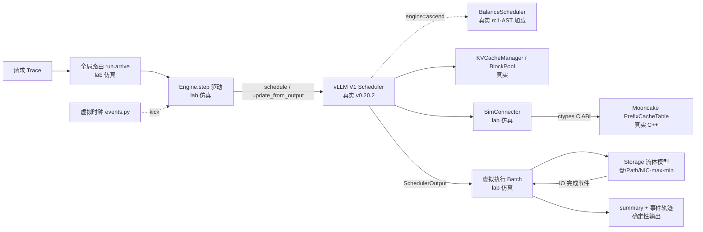

# 仿真架构说明：真实代码与仿真替换的边界

| 项目 | 约定 |
|---|---|
| 对象 | `mooncake-cpu-lab/`（vLLM v0.20.2 · vllm-ascend v0.20.2rc1 · Mooncake `fd72779`，vendor 哈希锁定） |
| 内容 | 上游三大件的原架构与本工程取用范围；逐模块的 mock 清单与替换机制；一批真实请求的完整生命周期走查 |
| 交互图 | [平台架构图](figures/fig_arch_platform.html)（archify，可缩放/聚焦）· [请求生命周期时序图](figures/fig_seq_lifecycle.html) |
| 证据 | 全部 file:line 指向当前仓库代码；生命周期走查使用 `results/lifecycle-demo/` 的真实事件轨迹 |
| 相关 | [总体设计](../Mooncake_vLLM_CPU_Simulation_Design.zh-CN.md) · [符合性检视](仿真环境符合性检视与vLLM-v0.20.2升级评估-20260922.md) · [机制验证实验](机制验证实验报告-20260923.md) |
| 日期 | 2026-09-23 |

## 1. 总览与切分原则

> **主视图（自上而下逻辑，对应 0913 文档 §1.1 的链式视角）**：
> - [fig_arch_layers.html](figures/fig_arch_layers.html)——**分层架构图**：请求自上而下经过输入层 → 全局调度层（Conductor 索引【真实】+ 路由【仿真】）→ 推理引擎层（vLLM/Ascend 调度与块管理【真实】+ 传输【仿真】）→ 虚拟执行与存储层【仿真】→ 输出层；每个组件的 tag 标注真实/mock 属性，右侧两条虚线是 IO 完成与延迟遥测反馈回路。
> - [fig_flow_request.html](figures/fig_flow_request.html)——**请求逻辑流程图**（泳道式）：到达 → 路由 → vLLM 组批/块分配 → 真实索引命中查询 → 逐层 KV 加载/计算/预取回环 → 首 token，与 0913 形式化模型的"到达→组批→读第一层→逐层计算→首 token"逐步对应。
>
> 细节视图：[fig_arch_platform.html](figures/fig_arch_platform.html)（组件图：模块级连线与数据流）· [fig_seq_lifecycle.html](figures/fig_seq_lifecycle.html)（时序图：一次 schedule 循环的消息级时序）



切分原则一句话：**保留"谁进入下一轮、分配多少资源"的全部决策代码，只替换"何时完成"的执行代码。** 这条线划在 Scheduler 与执行器之间：往左（队列规则、token 预算、chunk、KV 分配、抢占、状态机）是真实上游代码；往右（模型 forward、KV 传输、墙钟）是 lab 仿真。直接把 `torch.npu` 调用 stub 成空函数之所以被否决，是因为空返回会让"未完成的数据"被当成已就绪，破坏研究问题本身（见总体设计 §5）。

## 2. 上游三大件：原架构与取用范围

### 2.1 vLLM v0.20.2（tag `bc150f5`）

上游完整链路是：`vllm serve` 进程 → **EngineCore**（独立进程，busy loop）→ V1 `Scheduler` → KVConnector（scheduler 侧钩子 + worker 侧传输）→ ModelRunner / NPU·GPU Worker（真实 forward）→ 输出处理。本工程取用中间的控制层，两端不启动：

| 上游模块 | 处置 | 说明 |
|---|---|---|
| `v1/core/sched/scheduler.py` | **原样执行** | `schedule()` / `update_from_output()`：waiting/skipped_waiting 双队列、token 预算、chunked prefill、抢占与重算、`WAITING_FOR_REMOTE_KVS` 状态机全部真实 |
| `v1/core/kv_cache_manager.py`、`block_pool.py` | **原样执行** | 逻辑块分配/释放/`delay_cache_blocks` 预留（只分配元数据，无张量） |
| `v1/request.py`、`sampling_params.py`、`v1/outputs.py` | **原样执行** | 真实请求状态机、停止检查（`max_tokens`/`ignore_eos`）、真实 `ModelRunnerOutput`/`KVConnectorOutput`/`EngineCoreOutputs` |
| `kv_connector/v1/base.py` | **基类原样，子类仿真** | `SimConnector` 继承真实 `KVConnectorBase_V1`，实现其全部生命周期钩子 |
| `config` 包、`kv_cache_interface` | **类原样，实例伪造** | 真实 `CacheConfig`/`SchedulerConfig`/`KVCacheConfig`，但 VllmConfig 用 SimpleNamespace 拼装 |
| EngineCore 进程、NPUWorker/ModelRunner、tokenizer、结构化输出、OpenAI 服务、PD 分离 | **不启动** | 见 §6 |

### 2.2 vLLM-Ascend v0.20.2rc1（tag `367b8e6`）

上游以平台插件形式工作：`platform.py` 在启动时应用 `patch/platform/patch_balance_schedule.py`——它定义 `BalanceScheduler(Scheduler)` 并在**模块末尾把 `EngineCoreProc.run_engine_core` 全局替换**为自己的进程启动函数（DP 均衡用）。另有 opt-in 的 `RecomputeScheduler`/dynamic batch/profiling chunk 与 torch_npu/CANN 执行层。

本工程的处理（`lab/ascend_loader.py`）：对原始 `patch_balance_schedule.py` 做 **AST 节点选择执行**——只执行 import（排除 `vllm.v1.engine.core` 等三个会拉起进程链的模块）、特性开关函数 `_balance_scheduling_enabled` 和 `BalanceScheduler` 类定义，**不改写任何方法体**；类结构与上游不符时直接报错。效果：

- `--engine ascend` 执行的是**原始 `BalanceScheduler` 类**（源文件、行号、SHA-256 可溯源到 rc1 提交）；
- 均衡默认关闭（上游默认），`schedule()` 委托 vLLM 父类——因此 ascend 与 vllm 两引擎的默认轨迹逐事件一致（第 17 项测试断言）；
- `torch_npu` / `vllm.v1.engine.core` 从未进入 `sys.modules`（同样被测试断言）——CPU 实验台不会意外启动真实多进程/设备链路。

### 2.3 Mooncake Conductor（`fd72779`）

上游 Conductor 定位是 cache-aware router 使用的 **KV 前缀索引服务**（官方架构文档明确 indexer 与 router 分离；完整论文级全局路由器未公开）。本工程只取 C++ `prefixindex` 子集：

| 组件 | 处置 |
|---|---|
| `PrefixCacheTable`（Register/StoreShared/RemoveShared/Query） | **编译执行**：与 `hash_strategy.cpp`、`prefix_indexer.cpp` 一起编成 `build/libconductor_lab.so` |
| `HashStrategy`（hash profile `vllm_v1/sha256/0/low64_be`） | **编译执行**，与 vLLM 的 block hash 逐字节一致（测试断言） |
| router / 转移调度 / Transfer Engine / Store / ZMQ 服务 | **不引入**；全局路由是 lab 新增研究挂载点 |

## 3. Mock 清单：谁被替换、怎么替换

| # | 层 | 上游原本 | 仿真替换 | 机制要点 | 代码 |
|---|---|---|---|---|---|
| M1 | 墙钟 | `time.monotonic()` 驱动的调度间隔与到达时间 | **虚拟时钟** | 离散事件堆（`events.py`）；对 `vllm.v1.request`、`v1.core.sched.scheduler`、ascend 模块做**模块级 `time` 替换**（注入 `NS(time=…, monotonic=…)`），不碰进程全局 `time` | `engine.py:108-113` |
| M2 | KV 传输 | KVConnector worker 侧（NIXL/TorchNPU 等真实后端） | `SimConnector` | 实现真实基类的 `get_num_new_matched_tokens` / `update_state_after_alloc` / `build_connector_meta`；命中查询转发给真实 Mooncake 索引；`KVTransferConfig(kv_connector='SimConnector')` 使真实基类构造合法 | `engine.py:37-75,116-118` |
| M3 | 前缀索引访问 | 进程内 Python 对象 | **C ABI 桥 + ctypes** | `conductor_bridge.cpp` 用 `extern "C"` 包装真实 C++ 类（`mc_new/register/seed/query/hash/error`），Python 侧 `ctypes.CDLL` 绑定签名；hash profile 硬编码与 vLLM 对齐 | `native/conductor_bridge.cpp`、`lab/conductor.py` |
| M4 | 模型 forward | NPUWorker 逐层真实计算 | `Batch` + `compute_time()` | 由真实 `SchedulerOutput` 构造解析时延 `C(B)=α+(βΣq+γΣq(c+(q+1)/2))/η(B)`（上下文含复用 KV），按层均分；采样 token 为占位值 `[7]`，但产出走真实 `ModelRunnerOutput` | `run.py:74-84`、`engine.py:145-152,214-260` |
| M5 | KV 加载等待 | worker 侧逐层/整段传输 | 两种显式语义 | **layerwise**：每层 `s(l)=max(f(l-1), max_r a(r,l))` 整批 barrier，预取窗口 `prefetch_layers`；**async_full**：真实 `WAITING_FOR_REMOTE_KS` + `delay_cache_blocks` 预留，IO 完成回送真实 `KVConnectorOutput(finished_recving)` | `engine.py:167-205` |
| M6 | 共享存储 | 真实盘/NIC/RDMA | `Storage` 流体模型 | 一致性哈希环（64 vnode/盘）定盘、`(worker,hash)` 定 Path；每 flow 同时受盘/Path/NIC 三类容量约束，多资源 **max-min progressive filling** 求速率；流到达/完成时先结算字节再重算速率、重排完成事件 | `storage.py:20-115` |
| M7 | 引擎配置 | 完整 `VllmConfig`（ profiling 真实硬件） | SimpleNamespace 拼装 | 真实 `CacheConfig/SchedulerConfig/KVCacheConfig(FullAttentionSpec)` + 手工补 `observability_config`、`model_config` 等新版必读字段；`enable_prefix_caching=False`（保留真实块管理、禁本地缓存事件）；`NoStructuredOutput` 显式禁结构化输出 | `engine.py:78-102,28-34` |
| M8 | 引擎主循环 | EngineCore 进程 busy loop | `Engine.step()` 事件驱动 | 到达/IO 完成/计算完成均以 `kick()` 重新入队；无计算轮次也消费 connector 完成结果（防"无 runnable 请求收不到 IO 完成"死锁） | `engine.py:141-143,167-205` |
| M9 | 全局路由 | （上游无公开物） | lab 策略层 | RR / least_tokens / storage_aware；`estimated_io` 用真实索引命中 + 陈旧存储快照估 IO；遥测按 `telemetry_interval_s` 采样、`telemetry_delay_s` 延迟送达（防全知） | `run.py:86-135` |

**审计与确定性**：`vendor/` 全部文件哈希锁定于 `UPSTREAM.lock.json`（2279 条），`audit_sources.py` 校验"零改动"；每次运行把 vllm/torch 版本、调度器类名、调度器源文件 SHA-256 写进结果（`run.py:162-175`）；同配置两次运行事件轨迹逐字段一致。

## 4. 一批请求的完整生命周期（真实事件走查）

> **打开交互时序图**：[fig_seq_lifecycle.html](figures/fig_seq_lifecycle.html)（四段导览：到达与路由 / 命中查询与块分配 / 虚拟执行 / 完成回报）

场景：demo trace 前 4 个请求、单 worker、layerwise（`results/lifecycle-demo/`，确定性可复现）。r00：prompt 352 token、命中 256；r01/r02：命中 64/128；r03：无命中。

| 时刻 (s) | 事件 | 发生了什么（对应代码） |
|---|---|---|
| 0.0 | `dispatch r00 → w0` | 路由选定 worker，构造**真实 `Request`**（真实 hasher）入真实 waiting 队列（`run.py:104-119`、`engine.py:134-139`） |
| 0.0 | `schedule {r00: 96}`，free_blocks 233 | 真实 `schedule()` 内部：本地无缓存 → `SimConnector.get_num_new_matched_tokens` → ctypes → **真实 C++ `PrefixCacheTable.Query` 返回 256 命中** → 真实 `allocate_slots` 为整请求预留 23 块（352+4 token ÷16）→ 只调度 **96 个新 token**（352−256，真实调度器自动跳过缓存前缀） |
| 0.0001 | `io_submit r00:L1`（1 MB） | Batch 为命中块提交第 1 层 IO：16 块 × 64 KB/块·层（`bytes=2×kv_heads×head_dim×dtype×block_size`）；Storage 按哈希环定盘、定 Path，入 max-min 带宽求解 |
| 0.00097 | `state: stall→compute` | 第 1 层 IO 完成（1 MB ÷ 1.2 GB/s NIC ≈ 0.83 ms + 延迟），barrier 就绪开始计算；**预取窗口=2** 使 L2 的 IO 早已在途 |
| 0.0018 → 0.0071 | L1…L8 交替 `io_submit/io_done`、`stall/compute` 振荡 | 每层：IO 完成 → 层计算（`compute_time` 公式，~38 μs/层）→ 窗口滑动提交下层 |
| 0.00713 | `schedule {r00:1, r01:128, r02:32, r03:95}` | 真实调度器把 r00 的 decode 步（1 token）与 r01/r02 的 prefill、r03 的首段 chunk **合成一个混合批**——这是 vLLM continuous batching 的真实行为，不是仿真编排 |
| 0.01295 | `request_done r00` | r00 生成第 4 个 token，真实停止检查（`max_tokens`）判定完成，真实 `_free_request` 把 23 块还回 BlockPool（free 回升） |
| 结束 | `summary.json` | 全部完成后输出 TTFT 分布/SLO/goodput/compute·stall·idle/上游版本与调度器 SHA；r00 TTFT=7.13 ms ≈ 8 层×1 MB ÷ 1.2 GB/s + 计算（数字自洽） |

要点回顾：**每个"何时"由仿真给出（M4/M5/M6），每个"谁/多少"由真实代码给出**——批成员、96 vs 352 的 token 决策、混合批、块预留与释放、停止条件全部出自未改动的上游代码，且以上每一步都能在 `events.jsonl` 里复核。

## 5. 两种加载语义的差异（同一走查的变体）

同一批请求若配置 `load_mode=async_full`：真实 `allocate_slots(delay_cache_blocks=True)` 预留命中块、请求进入 `WAITING_FOR_REMOTE_KS`（v0.20.2 的 `skipped_waiting` 队列）；仿真提交单条整段 IO（`{rid}:all`，本例 8 MB）；完成后经真实 `KVConnectorOutput(finished_recving)` 通道恢复请求再计算未命中部分。两模式的分布差异与 `async_full` 在池压力下的准入死锁（预留 × 并发 × 无抢占回收）见[机制验证实验报告](机制验证实验报告-20260923.md) E2/E2b。

## 6. 未仿真清单（诚实边界）

- **执行真实性的缺失**：EngineCore 进程模型、NPUWorker/ModelRunner、torch_npu/CANN/HCCL、真实 Transfer Engine/Store/RDMA、网络协议细节（MTU/PFC/ECN/重传）；
- **功能边界**：tokenizer/多模态/结构化输出/PD 分离/动态 KV 写回与淘汰（池为初始只读）；
- **性能边界**：`timing_calibrated=false`——计算系数与带宽为演示值，一切绝对时间无物理意义；
- Conductor 仅索引器（上游现状），全局路由为 lab 新增策略挂载点。

## 7. 复现

```bash
cd mooncake-cpu-lab && bash scripts/setup.sh            # Linux/macOS
.venv/bin/python scripts/lifecycle_demo.py              # 重新生成本文走查数据 results/lifecycle-demo/
```

两张交互图由 archify 生成，可编辑的图规格随仓库保存于 `docs/figures/fig_arch_platform.json` 与 `fig_seq_lifecycle.json`；重新渲染需安装 archify 技能（`deliver` 命令）。
