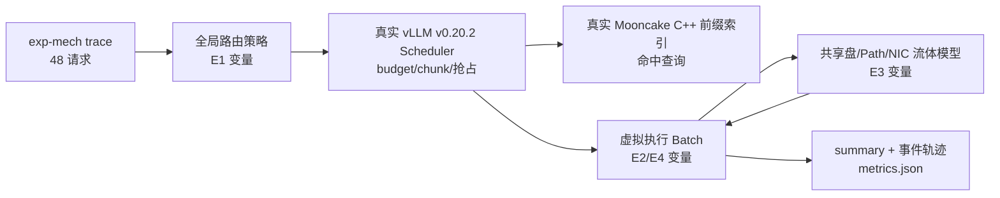
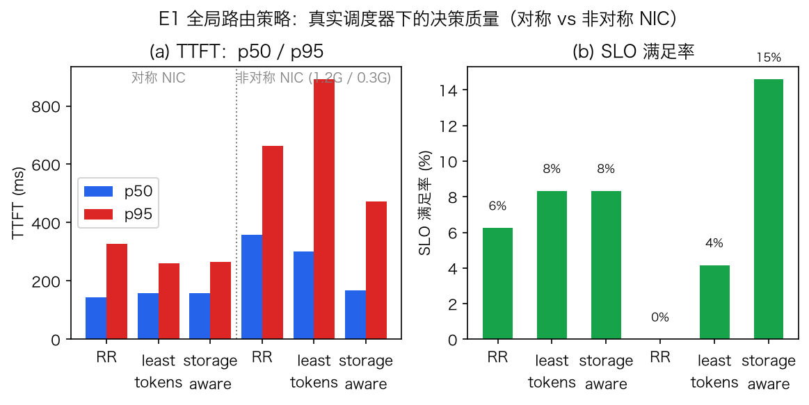
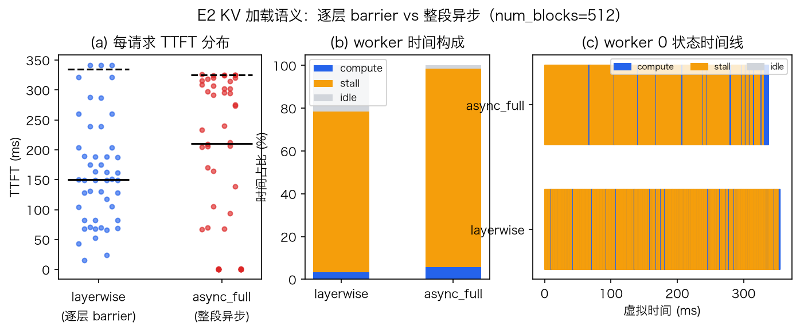
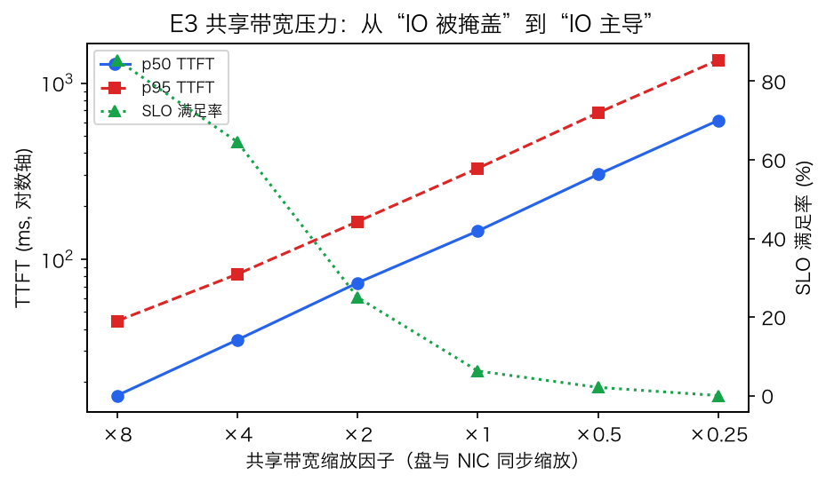
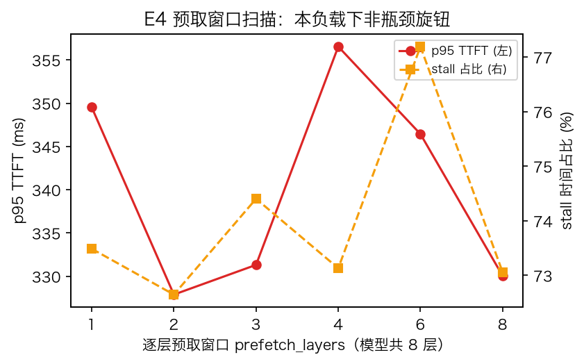
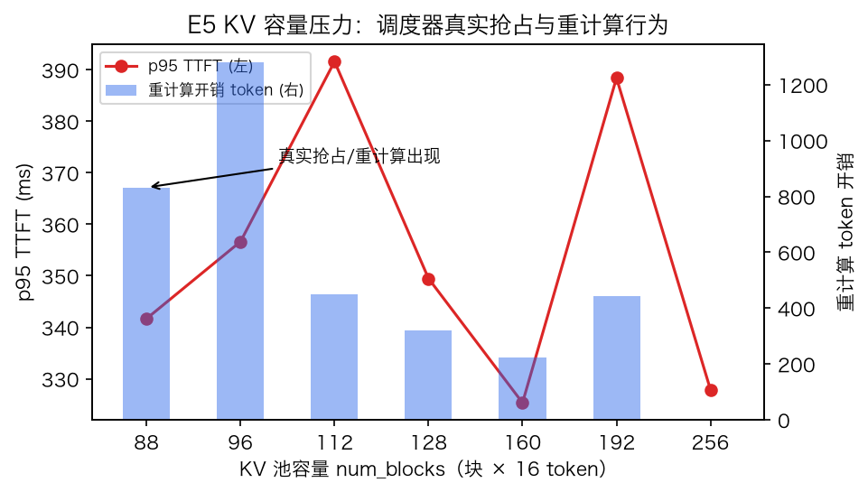

# 机制验证实验报告：真实控制代码仿真台的六组实验

| 项目 | 约定 |
|---|---|
| 研究问题 | 在真实 vLLM 调度代码 + 真实 Mooncake 前缀索引的 CPU 仿真台上，验证路由信息价值、两种 KV 加载语义、共享带宽干扰、预取窗口与 KV 容量压力的机制行为 |
| 实验对象 | `mooncake-cpu-lab/`（vLLM v0.20.2 原始 `Scheduler` + vllm-ascend v0.20.2rc1 `BalanceScheduler` + Mooncake `fd72779` C++ 前缀索引；引擎代码哈希锁定，见 `UPSTREAM.lock.json`） |
| 负载 | 合成 trace `traces/exp-mech.jsonl`：48 请求、3 个共享前缀族（768/512/256 token，同族请求命中同一批 Block）、25% 请求无命中、中段 1/3 突发加密到达、SLO 20–70 ms |
| 指标 | TTFT p50/p95/mean、SLO 满足率、goodput、相对隔离基线的归一化 TTFT、worker 的 compute/stall/idle 时间占比、重计算 token 开销（`schedule` 事件推导） |
| 运行环境 | macOS arm64（Apple Silicon）本机复现，17 项正确性测试全部通过；E0 验证同配置两次运行结果**逐字段一致** |
| 可信度边界 | **`timing_calibrated=false`：计算系数为演示值，所有绝对时间无物理意义**；本报告只做机制方向与相对比较，不构成任何性能结论；trace 为合成负载，非真实业务 |
| 文档性质 | 机制验证与平台能力演示；正式策略实验（E26–E31）见[研究设计](共享KV多ASU多Path下的组批错峰与带宽协同调度设计-20260917.md)，需先落地 G1–G9 增量 |
| 日期 | 2026-09-23 |

**结论速览**：(1) 对称同质环境下 storage-aware 路由与 least-tokens 决策趋同（符合设计文档预测），但引入非对称 NIC 后 storage-aware 全面占优——**路由价值来自信息，不来自启发式本身**；(2) 逐层 barrier 与整段异步两种 KV 加载语义呈现可区分的分布形态（p50 vs 尾部/goodput 权衡）；(3) 共享带宽扫描呈干净的"IO 被掩盖→IO 主导"相变（SLO 85%→0%）；(4) 预取窗口在本负载下非瓶颈旋钮；(5) KV 容量压力触发了**真实调度器抢占与重计算**（0→1280 token 可测开销）；(6) 发现 `async_full` 在池压力下的**准入死锁失效模式**（≤320 块必现，≥384 恢复），直接指向研究设计中的准入控制问题。

## 1. 实验设置

### 1.1 执行链与测量点



所有实验共用默认配置（`configs/demo.json`：2 worker、block 16、256 块、chunk 128、8 层模型、盘 40 GB/s、NIC 1.2 GB/s、layerwise、round_robin），每组实验只改表格中注明的变量。每组结果含完整事件轨迹（`results/mech-20260923/<组>/<变体>/`），可复核每个调度决策。

### 1.2 隔离基线与归一化 TTFT

每个请求先在**独享 worker、同带宽**条件下单独运行取其 TTFT 作为 `isolated_ttft_s`，汇总时输出 `mean(实际TTFT/隔离TTFT)`。该值刻画多租户共享下的干扰放大倍数，与[研究设计 §6.2](共享KV多ASU多Path下的组批错峰与带宽协同调度设计-20260917.md)的 $J_R$ 口径一致（无未来信息，在线可计算）。

## 2. E0 确定性回放

同配置连续两次运行，summary 与事件轨迹**逐字段一致**（`identical: true`）。这保证后文所有差异**只能来自被操纵的变量**，不来自调度或仿真的随机性。虚拟时钟同刻事件按优先级与序号排序（`lab/events.py`），无墙钟耦合。

## 3. E1 全局路由策略：信息决定决策质量

| 变体 | p50 (ms) | p95 (ms) | SLO | goodput (rps) | 归一化 TTFT | makespan (ms) |
|---|---:|---:|---:|---:|---:|---:|
| 对称 RR | 144.4 | 327.9 | 6.2% | 8.2 | 57.5 | 364.8 |
| 对称 least_tokens | 158.9 | 260.9 | 8.3% | 13.0 | 73.4 | 306.9 |
| 对称 storage_aware | 158.9 | 265.5 | 8.3% | 13.3 | 77.0 | 300.5 |
| 非对称 RR | 359.1 | 663.1 | 0% | 0 | 189.4 | 677.1 |
| 非对称 least_tokens | 302.1 | 890.7 | 4.2% | 1.9 | 123.5 | 1041.6 |
| **非对称 storage_aware** | **167.1** | **473.4** | **14.6%** | **13.8** | **37.8** | 506.5 |



**解读**：对称同质 NIC 下，storage_aware 与 least_tokens 的决策几乎一致（共享盘命中分布相同、NIC 同质，IO 估计项退化为排队项）——这正是[总体设计 §10.1](../Mooncake_vLLM_CPU_Simulation_Design.zh-CN.md)预言的现象，**不能**视为策略失效。把 worker 1 的 NIC 降到 1/4（0.3 GB/s）后差异立刻显形：least_tokens 看不到带宽维度，继续把命中请求派向慢 NIC（p95 恶化到 890.7ms、makespan 1042ms）；storage_aware 的 `estimated_io` 含 `NIC 队列字节/带宽` 项，避开慢路径后 p50 反而低于对称场景的 RR。归一化 TTFT 从 123.5/189.4 降到 37.8，说明收益来自**信息结构**而非评分公式——这为后续接入更强状态估计（P1 预计完成时间选路）提供了直接动机。

**局限**：非对称 NIC 是人工构造；真实场景的异构来自盘/路径拥塞，需要 G2/G3（组带宽与选路策略）落地后再验证。

## 4. E2 KV 加载语义与 E2b 准入死锁发现

两模式统一 `num_blocks=512`（消除 E2b 发现的池压力混淆变量）。

| 模式 | p50 (ms) | p95 (ms) | SLO | goodput (rps) | 归一化 TTFT | stall 占比 | makespan (ms) |
|---|---:|---:|---:|---:|---:|---:|---:|
| layerwise（逐层 barrier） | **150.2** | 334.3 | 6.2% | 8.5 | 61.1 | 75.1% | 354.7 |
| async_full（整段异步） | 210.8 | **324.9** | **25.0%** | **35.6** | 15.3 | 92.7% | **337.0** |



**解读**：(a) 图可见 async_full 呈两极分布——无命中请求（25%）不进入 `WAITING_FOR_REMOTE_KVS`，近乎零等待；命中请求则在 batch 前整段等待 KV。layerwise 的等待分摊到每层（`s(l)=max(f(l-1), max_r a(r,l))`），全体请求都慢一点但 p50 更好。async_full 换来了更好的尾部、goodput（35.6 vs 8.5 rps）与 makespan——整段传输把多个请求的 IO 合并成大流，在 NIC 上排队效率高于逐层碎片流。(c) 时间线可见 layerwise 的 stall/compute 交错更细碎，async_full 呈现长等待段后集中计算。两模式 stall 占比都高（demo 计算系数极小，IO 主导），**绝对值无意义**。

**E2b：async_full 的准入死锁（新发现）**

| num_blocks | 256 | 320 | 384 | 512 |
|---|---|---|---|---|
| 结果 | **死锁** | **死锁** | 正常 | 正常 |

死锁形态（`e2b-deadlock/b256` 诊断）：7 个请求处于 `WAITING_FOR_REMOTE_KVS`，其整段 KV 传输**已完成**（`finished_recving_kv_req_ids` 全部命中，`io_done` 已触发），但 KV 池被这些请求的命中块预留占满（free=15 块 < 后缀分配需求），提升后 `allocate_slots` 失败；无 running 请求可抢占回收；空调度返回后引擎不再自唤醒，虚拟时钟靠遥测空转至事件上限（虚拟时间漂移到 743s）。**机制链条**：`delay_cache_blocks` 预留式准入 × 突发并发 × 无抢占回收入口 × 引擎依赖外部 kick。三层含义：

1. 这是 0.20.2 真实调度器语义与实验台驱动的组合边界，不是 vendor 代码缺陷（≥384 块完全正常；demo 12 请求 trace 与 17 项测试均未覆盖此压力面）；
2. 它正是[研究设计](共享KV多ASU多Path下的组批错峰与带宽协同调度设计-20260917.md)中"中央准入收缩/预留上限"要研究的问题在真实代码里的具象化——async 通道需要显式准入控制；
3. 工程上应给引擎补一个"空调度但有未完成请求时的再唤醒"守卫（与抢占回收配合），已列入待办。

## 5. E3 共享带宽压力：从"IO 被掩盖"到"IO 主导"

盘与全部 NIC 同步缩放（f=8 → 盘 320 GB/s、NIC 9.6 GB/s；f=0.25 → 盘 10 GB/s、NIC 0.3 GB/s）。

| f | p50 (ms) | p95 (ms) | SLO | goodput (rps) | stall | compute | 归一化 TTFT |
|---:|---:|---:|---:|---:|---:|---:|---:|
| 8 | 16.8 | 44.5 | **85.4%** | 671.7 | 56.2% | 20.2% | 6.7 |
| 4 | 34.7 | 82.0 | 64.6% | 305.5 | 64.7% | 12.2% | 13.8 |
| 2 | 73.3 | 163.3 | 25.0% | 63.6 | 70.4% | 6.6% | 28.5 |
| 1 | 144.3 | 327.9 | 6.2% | 8.2 | 72.7% | 3.4% | 57.5 |
| 0.5 | 302.7 | 677.9 | 2.1% | 1.4 | 73.9% | 1.7% | 115.9 |
| 0.25 | 613.8 | 1352.7 | 0% | 0 | 75.5% | 0.9% | 241.8 |



**解读**：TTFT 随 1/f 近似线性（对数轴上等距），验证了流体带宽模型的字节守恒；p50 每降一档带宽精确翻倍。SLO 相变发生在 f≈2–4 之间（25%→64.6%）。stall 占比随带宽下降**饱和**在 ~75% 而非趋向 100%——因为低带宽下 worker 大部分时间在等 IO（stall），但排队深度的变化也拉长了"有 IO 在途但未到 barrier"的重叠窗口。compute 占比从 20% 稀释到 0.9% 同样是 IO 主导的佐证。该扫描是后续"跨 NPU 干扰"实验（研究设计 E28 存储竞争维度）的直接模板——换成只压一个盘、只压一个 NIC 的非对称扫描即可复用。

## 6. E4 逐层预取窗口：本负载下非瓶颈旋钮

| prefetch_layers | 1 | 2 | 3 | 4 | 6 | 8 |
|---|---:|---:|---:|---:|---:|---:|
| p95 TTFT (ms) | 349.5 | 327.9 | 331.3 | 356.5 | 346.4 | 330.1 |
| stall 占比 | 73.5% | 72.7% | 74.4% | 73.1% | 77.2% | 73.1% |



**解读**：窗口 1→8 变化在噪声范围内（p95 波动 <9%，无单调趋势）。机制原因：模型只有 8 层，且每层 IO 量大（命中族 768 token × 32KB/block），整层 barrier 的等待由**最慢成员**决定——预取提前量淹没在层传输时间内；窗口扩大反而轻微增加在途 IO 竞争（w=6 时 stall 77.2% 最高）。这与[形式化分析 §2.3](共享KV统一队列下的Batch效率与错峰调度形式化分析-20260913.md)的判断一致：窗口的价值取决于 `c_{βℓ}` 与层 IO 的比值，在 IO 主导、层数少的配置下可忽略。换成真实模型（数十层、逐层 IO 小）结论可能反转——这是**负载条件结论**，不是普适结论。

## 7. E5 KV 容量压力：真实抢占与重计算

| num_blocks | 256 | 192 | 160 | 128 | 112 | 96 | 88 |
|---|---:|---:|---:|---:|---:|---:|---:|
| 重计算开销 (token) | **0** | 444 | 224 | 319 | 448 | **1280** | 832 |
| p95 TTFT (ms) | 327.9 | 388.4 | 325.3 | 349.5 | 391.6 | 356.7 | 341.7 |
| SLO | 6.2% | 8.3% | 14.6% | 14.6% | 18.8% | 12.5% | 12.5% |



**解读**：256 块时无任何重计算；容量降到 192 块以下，**真实 vLLM 调度器的抢占-重算路径被激活**（重计算 token 0→1280，每个数字可从 `schedule` 事件的逐请求 token 记账复核）。p95 未随容量崩塌，因为在 demo 系数下重算代价远小于 IO 等待（compute 仅占 3-5%）——在计算主导的真实画像下该曲线会更陡峭。SLO 在中段略升属于抢占重排的随机受益（48 样本，不解读为因果收益）。机制要点：**容量压力的第一可测信号是重计算开销，而不是 TTFT**——做容量规划实验时应同时报告这两个量。

## 8. 与研究设计的对接

本报告验证的机制构成[研究设计](共享KV多ASU多Path下的组批错峰与带宽协同调度设计-20260917.md) E26（解析校验）在真实代码上的前置基线，但距离正式实验还差 G1–G9 增量（见[符合性检视](仿真环境符合性检视与vLLM-v0.20.2升级评估-20260922.md)）：

| 本报告发现 | 对应研究设计增量 |
|---|---|
| 路由价值来自信息结构（E1） | G3 P1 预计完成时间选路、观测协议（噪声/版本） |
| async_full 准入死锁（E2b） | G4 中央队列准入收缩、G5 池管理/写回 |
| 带宽相变与干扰放大（E3） | G1/G2 SS/LS/SL/LL 分组与 B0/B1 带宽规则 |
| 预取窗口条件性无效（E4） | 真实模型层数/画像下的重做（G8） |
| 重计算先于 TTFT 恶化（E5） | 容量规划与抢占 victims 选择实验 |

## 9. 复现

```bash
cd mooncake-cpu-lab
bash scripts/setup.sh                          # 环境（Linux/macOS，17 项测试）
.venv/bin/python scripts/make_exp_trace.py     # 生成 traces/exp-mech.jsonl
.venv/bin/python scripts/mechanism_experiments.py   # 全矩阵 → results/mech-20260923/
uv pip install --python .venv/bin/python matplotlib  # 仅绘图需要
.venv/bin/python scripts/plot_mechanism.py     # 本报告全部图 → docs/figures/
```

结果为确定性输出：同 trace 同配置重跑逐字段一致（E0）。原始数据：`mooncake-cpu-lab/results/mech-20260923/metrics.json` 及各变体 `summary/config/events/requests`。
